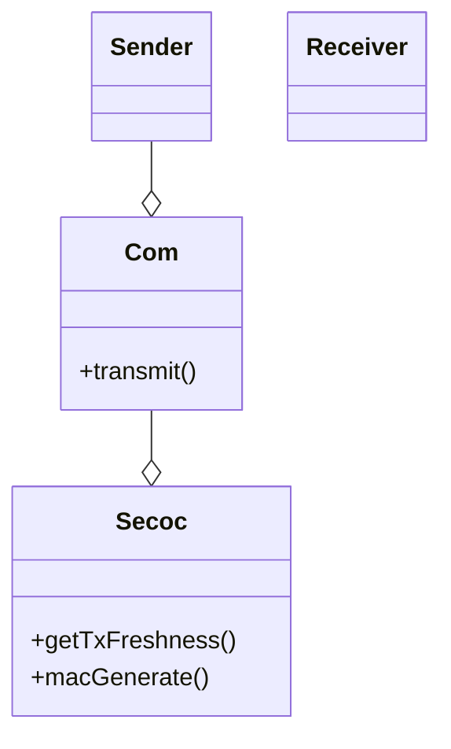

# Introduction
Mock implementation of Secure Onboard Communication

# Tech Stack

- Programming: C++
- Build tool: CMake
- Architecture: Mermaid
- Security modules: 

# Architecture

```mermaid
classDiagram
    class Sender {
    }

    class Receiver {
    }

    class Secoc {
        +getTxFreshness()
        +macGenerate()
    }

    class Com {
        +transmit()
    }

    Sender --o Com
    Com --o Secoc
```